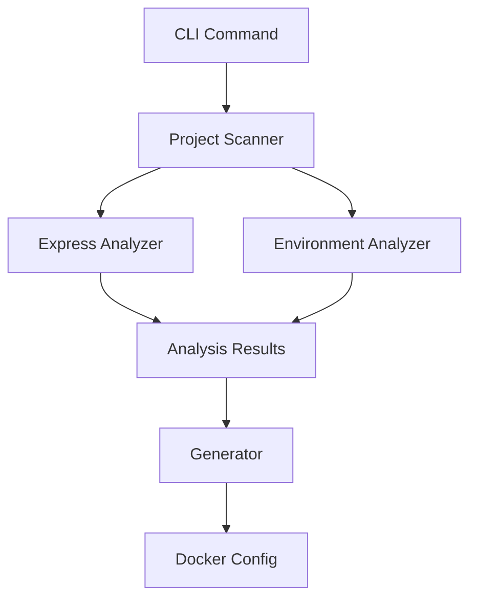
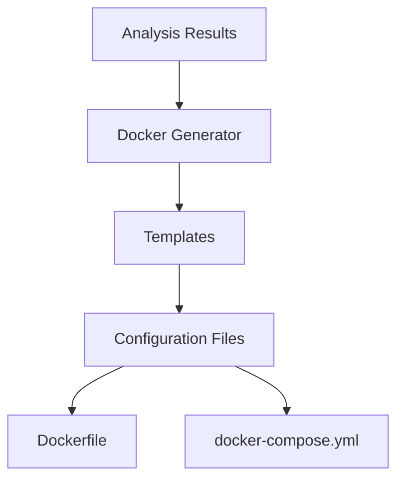

# Architecture Guide

This document provides an overview of DevEnvBootstrap's architecture, design patterns, and system components.

## System Overview

DevEnvBootstrap is structured in layers:

```
┌─────────────────────────────┐
│           CLI Layer         │
├─────────────────────────────┤
│        Analyzers Layer      │
├─────────────────────────────┤
│       Generators Layer      │
├─────────────────────────────┤
│         Utils Layer         │
└─────────────────────────────┘
```

### Core Components

1. **CLI Layer**
   - Command processing
   - User interaction
   - Configuration management

2. **Analyzers Layer**
   - Project structure analysis
   - Dependency scanning
   - Environment configuration

3. **Generators Layer**
   - Docker configuration generation
   - Environment setup
   - Service configuration

4. **Utils Layer**
   - File system operations
   - Validation utilities
   - Common helpers

## Component Details

### CLI Layer

```typescript
// Component Structure
cli/
├── commands/          // Command implementations
├── formatters/        // Output formatting
└── utils/            // CLI-specific utilities
```

Key Components:
- `Command` classes for each CLI command
- `ConfigManager` for configuration handling
- `ProgressIndicator` for user feedback

### Analyzers Layer

```typescript
// Component Structure
analyzers/
├── project-scanner.ts    // Main project analysis
├── express-analyzer.ts   // Express.js specific analysis
└── environment-analyzer.ts // Environment configuration
```

Responsibilities:
- Project type detection
- Dependency analysis
- Service detection
- Configuration analysis

### Generators Layer

```typescript
// Component Structure
generators/
├── docker-config.ts         // Docker configuration
├── express-docker-generator.ts // Express-specific
└── templates/              // Configuration templates
```

Features:
- Multi-stage Dockerfile generation
- Docker Compose configuration
- Service integration
- Environment setup

### Utils Layer

```typescript
// Component Structure
utils/
├── file-system.ts    // File operations
├── validation.ts     // Data validation
└── logger.ts         // Logging utilities
```

Common Utilities:
- File system operations
- Validation helpers
- Logging functions

## Data Flow

### Analysis Flow



### Generation Flow



## Design Patterns

### 1. Command Pattern

Used in CLI implementation:

```typescript
interface Command {
  execute(): Promise<void>;
}

class AnalyzeCommand implements Command {
  async execute(): Promise<void> {
    // Implementation
  }
}
```

### 2. Factory Pattern

Used for analyzer and generator creation:

```typescript
class AnalyzerFactory {
  createAnalyzer(type: string): Analyzer {
    switch (type) {
      case 'express':
        return new ExpressAnalyzer();
      default:
        return new DefaultAnalyzer();
    }
  }
}
```

### 3. Strategy Pattern

Used for different analysis strategies:

```typescript
interface AnalysisStrategy {
  analyze(path: string): Promise<Analysis>;
}

class ExpressAnalysis implements AnalysisStrategy {
  async analyze(path: string): Promise<Analysis> {
    // Express-specific analysis
  }
}
```

## Extension Points

### 1. Custom Analyzers

```typescript
abstract class BaseAnalyzer {
  abstract analyze(path: string): Promise<Analysis>;
}

class CustomAnalyzer extends BaseAnalyzer {
  async analyze(path: string): Promise<Analysis> {
    // Custom implementation
  }
}
```

### 2. Custom Generators

```typescript
abstract class BaseGenerator {
  abstract generate(config: Config): Promise<string>;
}

class CustomGenerator extends BaseGenerator {
  async generate(config: Config): Promise<string> {
    // Custom implementation
  }
}
```

## Configuration System

### Configuration Hierarchy

1. Command-line arguments
2. Environment variables
3. Project configuration file
4. Global configuration file
5. Default values

### Configuration Loading

```typescript
class ConfigManager {
  async loadConfig(): Promise<Config> {
    return {
      ...this.loadDefaults(),
      ...this.loadGlobalConfig(),
      ...this.loadProjectConfig(),
      ...this.loadEnvConfig(),
      ...this.loadCliConfig()
    };
  }
}
```

## Security Considerations

### 1. File System Security

- Restricted access patterns
- Safe file operations
- Path validation

```typescript
class FileSystemUtils {
  private validatePath(path: string): void {
    // Security validation
  }
}
```

### 2. Configuration Security

- Environment variable handling
- Sensitive data protection
- Secure defaults

### 3. Docker Security

- Non-root users
- Minimal base images
- Security headers
- Volume permissions

## Error Handling

### Error Hierarchy

```typescript
class BaseError extends Error {
  constructor(message: string, public code: string) {
    super(message);
  }
}

class AnalysisError extends BaseError {}
class GenerationError extends BaseError {}
```

### Error Recovery

```typescript
try {
  await analyzer.analyze(path);
} catch (error) {
  if (error instanceof AnalysisError) {
    // Handle analysis errors
  }
  // Handle other errors
}
```

## Performance Considerations

1. **Lazy Loading**
   - On-demand module loading
   - Deferred analysis
   - Cache utilization

2. **Resource Management**
   - File handle limits
   - Memory usage
   - Concurrent operations

3. **Caching Strategy**
   - Analysis results
   - Generated configurations
   - Template compilation

## Monitoring and Logging

### Logging Levels

```typescript
enum LogLevel {
  DEBUG,
  INFO,
  WARN,
  ERROR
}
```

### Metrics Collection

- Operation timing
- Success rates
- Resource usage
- Error frequency

## See Also

- [Development Guide](./development.md)
- [Testing Guide](./testing.md)
- [Style Guide](./style.md)
